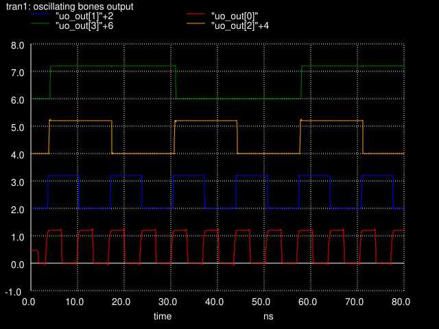

<!---

This file is used to generate your project datasheet. Please fill in the information below and delete any unused
sections.

You can also include images in this folder and reference them in the markdown. Each image must be less than
512 kb in size, and the combined size of all images must be less than 1 MB.
-->

## How it works

A simple yet stylish ring oscillator that uses a chain of 21 SkullFET inverters to generate a square wave output. Based on simulation, the oscillator should have a frequency of around 148.6 MHz.

| Pin       | Expected frequency |
|-----------|--------------------|
| osc_out   | 148.6 MHz          |
| osc_div_2 | 74.3 MHz           |
| osc_div_4 | 37.1 MHz           |
| osc_div_8 | 18.6 MHz           |

## How to test

Connect an oscilloscope to one of the output pins (eg. `osc_div_8` / `uo_out[3]`) and enjoy the show.

## Simulation results

The following graph shows the output of the oscillator and the divided outputs. It was generated by running `make -C docs/layout_sim.png`:

The outputs are shifted by 2 volts to make them easier to see in the graph. "uo_out[0]" is the main output of the oscillator and "uo_out[1]"/"uo_out[2]"/"uo_out[3]" are the divided outputs.

Please note that the simulation results do not account for all parasitics, only the primary ones. Consequently, the actual frequency of the oscillator is likely to be lower than the simulated value.
